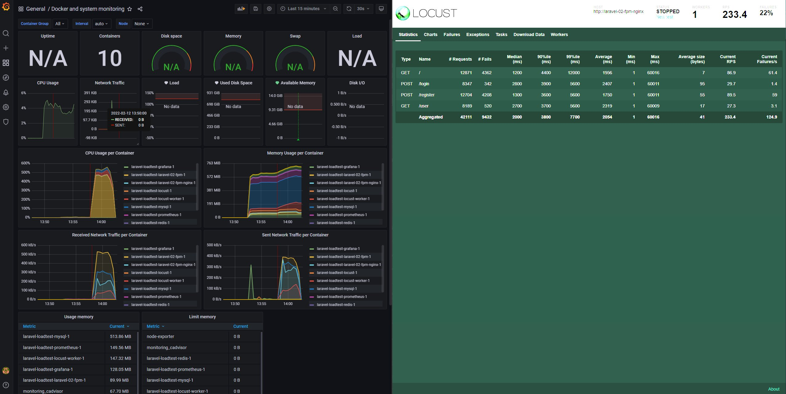

# laravel-loadtest

PHP runtime load testing with Laravel

Plus docker-compose.yml/Dockerfile samples.

## Target

1. [Apache2.4](https://httpd.apache.org/) + mod_php
2. [nginx](https://nginx.org/en/) + [php-fpm](https://www.php.net/manual/en/install.fpm.php)
3. [nginx unit](https://unit.nginx.org/)
4. [RoadRunner](https://roadrunner.dev/)(behind [Laravel Octane](https://laravel.com/docs/8.x/octane))

## Test environment

- WSL2(Ubuntu 20.04.3) on Windows10
- CPU: AMD Ryzen 7 3700X 8-Core
- Memory: 16 GB
- Laravel v8.82.0
- PHP 8.0.14
- Locust: 2.7.2
- Prometheus: 2.32.1

### Docker

```
$ docker version
Client: Docker Engine - Community
 Version:           20.10.12
 API version:       1.41
 Go version:        go1.16.12
 Git commit:        e91ed57
 Built:             Mon Dec 13 11:45:33 2021
 OS/Arch:           linux/amd64
 Context:           default
 Experimental:      true

Server: Docker Engine - Community
 Engine:
  Version:          20.10.12
  API version:      1.41 (minimum version 1.12)
  Go version:       go1.16.12
  Git commit:       459d0df
  Built:            Mon Dec 13 11:43:42 2021
  OS/Arch:          linux/amd64
  Experimental:     true
 containerd:
  Version:          1.4.12
  GitCommit:        7b11cfaabd73bb80907dd23182b9347b4245eb5d
 runc:
  Version:          1.0.2
  GitCommit:        v1.0.2-0-g52b36a2
 docker-init:
  Version:          0.19.0
  GitCommit:        de40ad0

$ docker compose version
Docker Compose version v2.2.3
```

## Result

### Summary


- Apache, nginx unit and RoadRunner is stable(has no failure).
    - php-fpm has failure requests.
- RoadRunner(about 400 rps) runs twice as fast as Apache(about 200 rps).
- nginx unit increased response time linearly for certain number of requests.

### Apache + mod_php


```csv
Type ,Name       ,Request Count ,Failure Count ,Median Response Time ,Average Response Time ,Min Response Time  ,Max Response Time  ,Average Content Size ,Requests/s         ,Failures/s ,50% ,66% ,75% ,80% ,90% ,95% ,98%   ,99%   ,99.9%  ,99.99% ,100%
GET  ,/          ,10514         ,0             ,6                    ,1868.1894447423442    ,3.615924999849085  ,144274.3889899998  ,11.0                 ,45.972785616332224 ,0.0        ,6   ,6   ,7   ,7   ,13  ,22  ,48000 ,93000 ,108000 ,144000 ,144000
POST ,/login     ,10236         ,0             ,60                   ,63.19641408714408     ,53.364038999916374 ,192.5710179998532  ,99.0                 ,44.757222138936335 ,0.0        ,60  ,62  ,63  ,64  ,68  ,83  ,120   ,130   ,170    ,190    ,190
POST ,/register  ,10241         ,0             ,67                   ,467.58879590694096    ,57.37784000029933  ,141931.2456470002  ,82.0                 ,44.779084791407485 ,0.0        ,67  ,70  ,73  ,74  ,82  ,97  ,130   ,140   ,110000 ,141000 ,142000
GET  ,/user      ,10236         ,0             ,9                    ,10.539792544645117    ,6.357847000344918  ,166.13893800013102 ,18.0                 ,44.757222138936335 ,0.0        ,9   ,10  ,11  ,11  ,13  ,16  ,20    ,25    ,95     ,160    ,170
     ,Aggregated ,41227         ,0             ,55                   ,610.8978216214371     ,3.615924999849085  ,144274.3889899998  ,52.22373687146773    ,180.2663146856124  ,0.0        ,55  ,61  ,64  ,66  ,72  ,81  ,120   ,140   ,105000 ,138000 ,144000
```

- No failures.
- Extremely slow in rare cases.

### nginx + php-fpm



```csv
Type ,Name       ,Request Count ,Failure Count ,Median Response Time ,Average Response Time ,Min Response Time  ,Max Response Time ,Average Content Size ,Requests/s         ,Failures/s         ,50%  ,66%  ,75%  ,80%  ,90%  ,95%  ,98%  ,99%   ,99.9% ,99.99% ,100%
GET  ,/          ,12871         ,4362          ,1200.0               ,1956.3762488766995    ,1.012581999930262  ,60016.234768      ,7.387304793722321    ,55.899288209991994 ,18.944347383418933 ,1200 ,2800 ,3300 ,3400 ,4400 ,5500 ,8500 ,12000 ,36000 ,60000  ,60000
POST ,/login     ,8347          ,342           ,2800.0               ,2406.8120073027426    ,1.0153160001209471 ,60010.91787000019 ,94.96369953276627    ,36.25136809018749  ,1.4853202212584307 ,2800 ,3300 ,3400 ,3500 ,3900 ,4700 ,5400 ,5600  ,12000 ,60000  ,60000
POST ,/register  ,12704         ,4208          ,1300.0               ,1749.8805279032588    ,0.9263499998724001 ,60010.61475999995 ,54.87822732997481    ,55.17400026569329  ,18.275518979694375 ,1300 ,2900 ,3300 ,3400 ,3600 ,4500 ,5200 ,5600  ,20000 ,60000  ,60000
GET  ,/user      ,8189          ,520           ,2700.0               ,2319.045340666502     ,0.93426500006899   ,60008.57017099997 ,16.918182928318476   ,35.56516752013243  ,2.258381622966035  ,2700 ,3200 ,3400 ,3400 ,3700 ,4600 ,5300 ,5600  ,19000 ,60000  ,60000
     ,Aggregated ,42111         ,9432          ,2000.0               ,2053.889079942271     ,0.9263499998724001 ,60016.234768      ,40.926598750920185   ,182.8898240860052  ,40.96356820733777  ,2000 ,3200 ,3400 ,3400 ,3800 ,4700 ,5700 ,7700  ,22000 ,60000  ,60000
```

```csv
Method ,Name      ,Error                                                                                      ,Occurrences
GET    ,/user     ,"ConnectionResetError(104, 'Connection reset by peer')"                                    ,24
POST   ,/login    ,"ConnectionResetError(104, 'Connection reset by peer')"                                    ,18
POST   ,/register ,CatchResponseError('Invalid code: 0')                                                      ,4205
GET    ,/         ,RemoteDisconnected('Remote end closed connection without response')                        ,3755
POST   ,/login    ,RemoteDisconnected('Remote end closed connection without response')                        ,323
POST   ,/login    ,HTTPError('504 Server Error: Gateway Time-out for url: http://laravel-02-fpm-nginx/login') ,1
GET    ,/         ,HTTPError('502 Server Error: Bad Gateway for url: http://laravel-02-fpm-nginx/')           ,2
GET    ,/user     ,HTTPError('504 Server Error: Gateway Time-out for url: http://laravel-02-fpm-nginx/user')  ,3
GET    ,/         ,HTTPError('504 Server Error: Gateway Time-out for url: http://laravel-02-fpm-nginx/')      ,7
GET    ,/         ,"ConnectionResetError(104, 'Connection reset by peer')"                                    ,598
POST   ,/register ,CatchResponseError('Invalid code: 504')                                                    ,3
GET    ,/user     ,RemoteDisconnected('Remote end closed connection without response')                        ,493
```

- some failures 🦴.
- Median response time is slow.

### nginx unit


```csv
Type ,Name       ,Request Count ,Failure Count ,Median Response Time ,Average Response Time ,Min Response Time ,Max Response Time  ,Average Content Size ,Requests/s         ,Failures/s ,50%   ,66%   ,75%   ,80%   ,90%   ,95%   ,98%   ,99%   ,99.9% ,99.99% ,100%
GET  ,/          ,1994          ,0             ,14000.0              ,13609.744020604317    ,6.798829999979716 ,27302.611280000063 ,11.0                 ,9.715961699020356  ,0.0        ,14000 ,18000 ,21000 ,22000 ,25000 ,26000 ,27000 ,27000 ,27000 ,27000  ,27000
POST ,/login     ,1492          ,0             ,14000.0              ,13531.813830516086    ,54.17121999994379 ,27313.352868000038 ,99.0                 ,7.269917179006204  ,0.0        ,14000 ,18000 ,21000 ,22000 ,26000 ,26000 ,27000 ,27000 ,27000 ,27000  ,27000
POST ,/register  ,1717          ,0             ,14000.0              ,13560.566945165408    ,61.25557099994694 ,27387.015026000197 ,82.0                 ,8.36625187423167   ,0.0        ,14000 ,18000 ,21000 ,22000 ,25000 ,26000 ,27000 ,27000 ,27000 ,27000  ,27000
GET  ,/user      ,1293          ,0             ,14000.0              ,13513.131971850735    ,7.905277999952887 ,27341.067264000005 ,18.0                 ,6.300270048562347  ,0.0        ,14000 ,18000 ,21000 ,22000 ,25000 ,26000 ,27000 ,27000 ,27000 ,27000  ,27000
     ,Aggregated ,6496          ,0             ,14000.0              ,13559.616517344053    ,6.798829999979716 ,27387.015026000197 ,51.37161330049261    ,31.652400800820576 ,0.0        ,14000 ,18000 ,21000 ,22000 ,25000 ,26000 ,27000 ,27000 ,27000 ,27000  ,27000
```

- no failures.
- Median response time is slow.
- no scaling(perhaps becaulse of cpus limit?)

### RoadRunner


```csv
Type ,Name       ,Request Count ,Failure Count ,Median Response Time ,Average Response Time ,Min Response Time  ,Max Response Time  ,Average Content Size ,Requests/s        ,Failures/s ,50% ,66%  ,75%  ,80%  ,90%  ,95%  ,98%  ,99%  ,99.9% ,99.99% ,100%
GET  ,/          ,22661         ,0             ,620.0                ,686.0100739353505     ,1.7283189999943716 ,1820.2351189997898 ,11.0                 ,98.1907207658494  ,0.0        ,620 ,1000 ,1200 ,1300 ,1400 ,1500 ,1500 ,1600 ,1700  ,1800   ,1800
POST ,/login     ,22310         ,0             ,680.0                ,739.8630925711354     ,48.17444099990098  ,1857.2384980002425 ,99.0                 ,96.66982835206302 ,0.0        ,680 ,1100 ,1300 ,1400 ,1500 ,1500 ,1600 ,1600 ,1800  ,1900   ,1900
POST ,/register  ,22492         ,0             ,690.0                ,755.3494069234396     ,52.70074300005945  ,1869.7350940001343 ,82.0                 ,97.45843923328559 ,0.0        ,690 ,1100 ,1300 ,1400 ,1500 ,1600 ,1600 ,1600 ,1800  ,1900   ,1900
GET  ,/user      ,22161         ,0             ,630.0                ,689.2725135808386     ,2.4813560003167368 ,1820.1287659999252 ,18.0                 ,96.02420735589729 ,0.0        ,630 ,1000 ,1300 ,1400 ,1400 ,1500 ,1500 ,1600 ,1700  ,1800   ,1800
     ,Aggregated ,89624         ,0             ,660.0                ,717.6237047520526     ,1.7283189999943716 ,1869.7350940001343 ,52.45473310720343    ,388.3431957070953 ,0.0        ,660 ,1000 ,1300 ,1400 ,1500 ,1500 ,1600 ,1600 ,1800  ,1900   ,1900
```

- no failures.
- good rps(388).
